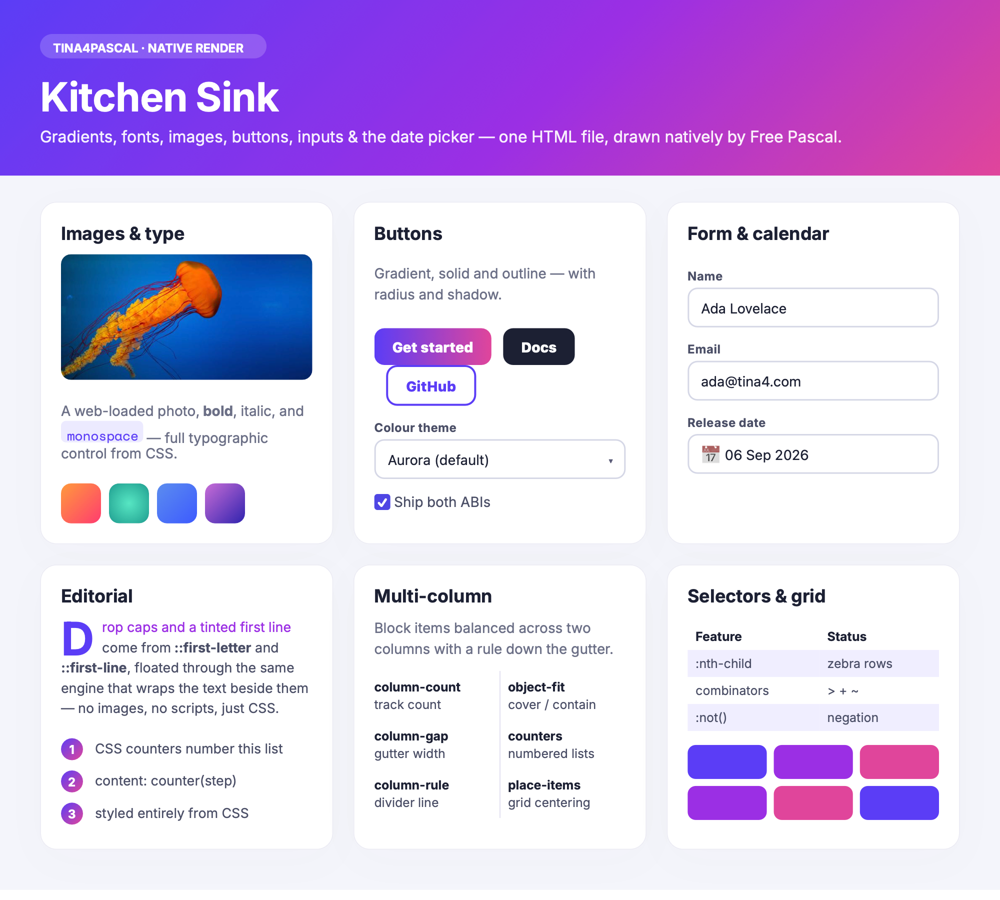
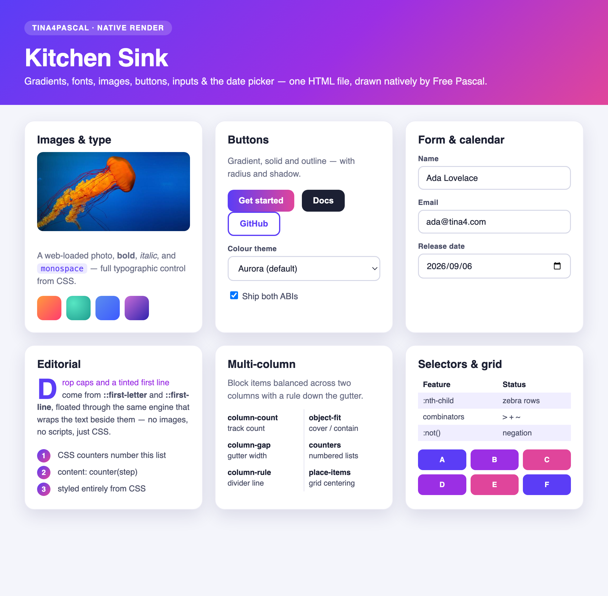
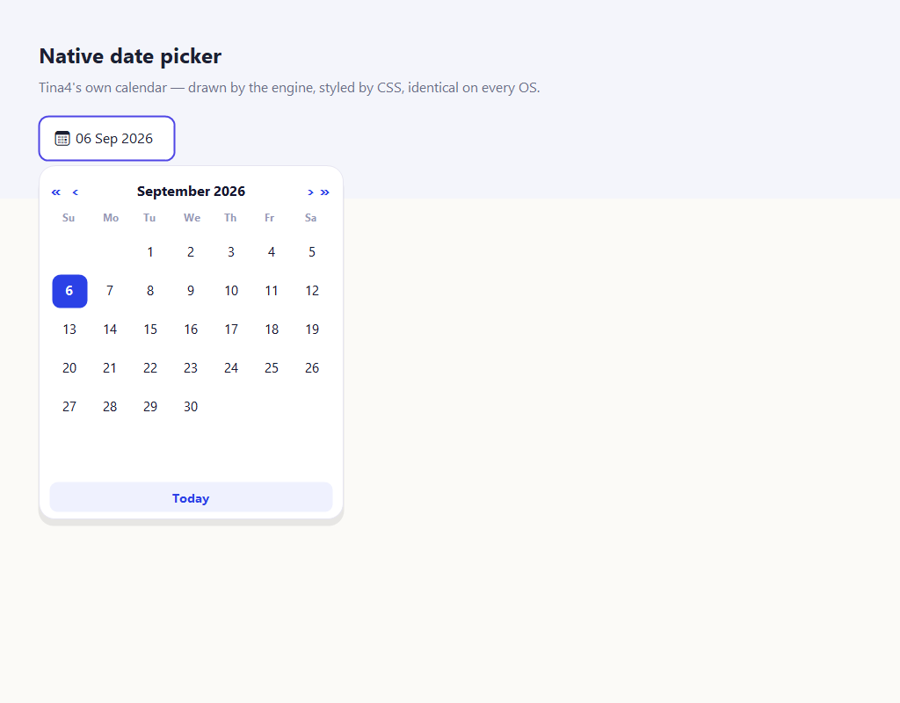
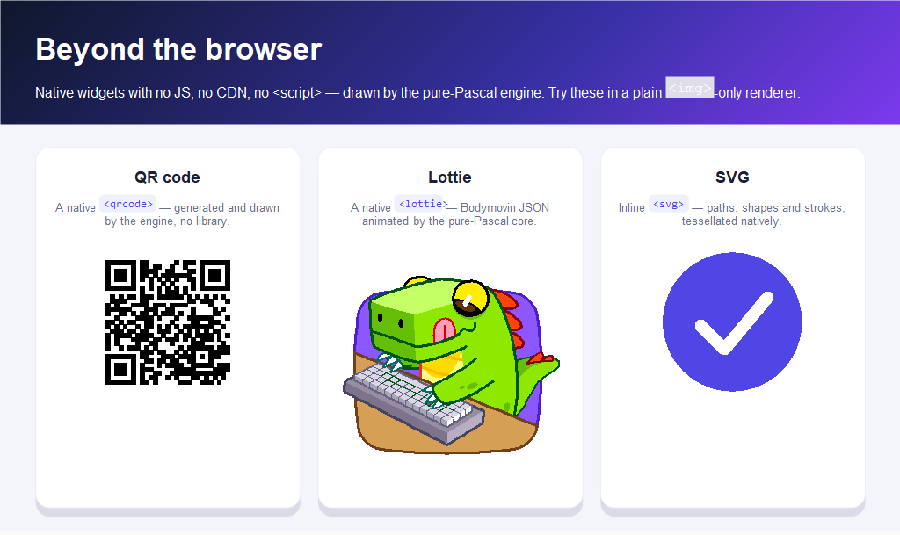

<p align="center">
  
</p>

<h1 align="center">Tina4Pascal</h1>

<p align="center">
  <strong>HTML-driven native apps in Free Pascal — one codebase, six targets,
  no browser, no widget toolkit.</strong>
</p>

Tina4Pascal is the Free Pascal sibling of
[Tina4Delphi](https://github.com/tina4stack/tina4delphi). It takes the same
idea — the UI is HTML + CSS, the app is an event loop — and compiles it to a
**single ~1.3 MB native binary** per target (macOS, Windows, Linux x64/arm64,
Android, iOS) that carries the whole engine and no runtime. See
[App sizes](#app-sizes).

### The same app, rendered natively — no browser, no WebView

<table>
<tr>
<td valign="top"><br><sub><b>Windows</b> · Win32 + GDI+</sub></td>
<td valign="top" align="center"><br><sub><b>Android</b> · JNI → Canvas<br>(built from Windows)</sub></td>
</tr>
</table>

One HTML file — `showcase.html` — byte-identical, drawn by the native engine on
each platform. The **Lottie** dino is a Bodymovin animation rendered by the
pure-Pascal core (**no Skia, no JS**); the same page lays out `<video>`,
gradients, `transform`, `position:fixed` and form controls. The CSS engine even
digests the real `bootstrap.min.css`.

## Install

```powershell
# Windows (PowerShell)
irm https://raw.githubusercontent.com/tina4stack/tina4pascal/main/scripts/install.ps1 | iex
```

```sh
# macOS / Linux
curl -fsSL https://raw.githubusercontent.com/tina4stack/tina4pascal/main/scripts/install.sh | sh
```

That puts `tina4pascal` on your PATH. FPC is fetched on your first `init`, so a
clean machine is ready in about two minutes.

## Quick start

Install (above), then one command:

```sh
tina4pascal init hello
```

It scaffolds the project, fetches FPC if you don't have it, builds, and opens a
native window showing **Hello World!** with the logo — your first app in about
two minutes, same command on every OS. No FPC flags, nothing to install by hand.

Then keep going:

```sh
cd hello
tina4pascal run             # rebuild & run after you edit src/templates + src/routes
tina4pascal build android   # ship an APK (arm64 + armv7 + x86_64), signed
tina4pascal doctor          # see the whole toolchain
```

## Guess the browser

One of these is Chrome. The other is a **~1.4 MB native binary** with no browser,
no WebView, no HTML/CSS engine but its own — the same `kitchen-sink.html`,
rendered by pure Free Pascal. Which is which?

<table>
<tr>
<td width="50%" valign="top"><br><sub align="center"><b>A</b></sub></td>
<td width="50%" valign="top"><br><sub><b>B</b></sub></td>
</tr>
</table>

<details>
<summary><b>Reveal</b></summary><br>

**A is Tina4Pascal** (native Free Pascal); **B is Chrome.** Gradients, the
web-loaded photo, bold/italic/monospace type, linear + radial swatches,
gradient/solid/outline buttons, the `<select>`, the checkbox, the
`font-weight:800` heading and the whole card layout all match. The only tells
are the platform form widgets: the `<input type="date">` (Tina4 formats it
`06 Sep 2026` with a calendar glyph; Chrome shows the OS `2026/09/06` spinner)
and the `<select>` chevron — Tina4 draws both itself, so they follow **your
CSS**, not the OS. Reproduce it with `tools/tina4pascal render` beside any
browser.

And because Tina4 owns the widget, opening that date field gives you a full
**native calendar** — engine-drawn, CSS-styled, identical on every platform (no
OS date dialog):

<p></p>
</details>

## Beyond the browser

And it goes the other way too — native widgets a plain HTML renderer *can't* do,
with no `<script>`, no CDN, no JS runtime:



```html
<!-- a real, scannable QR — generated and drawn by the engine -->
<qrcode value="https://github.com/tina4stack/tina4pascal" width="180"></qrcode>

<!-- a Bodymovin animation, animated by the pure-Pascal core (no Skia, no lottie.js) -->
<lottie width="280" height="280">{ "v":"5.5.2", "fr":60, ...bodymovin JSON... }</lottie>

<!-- inline SVG: paths, shapes, strokes -->
<svg viewBox="0 0 100 100"><path d="M30 52 L45 67 L72 34" stroke="#fff" .../></svg>
```

The `<qrcode>` and `<lottie>` tags are part of the engine — the same markup
renders on every target. See `examples/pages/native-widgets.html`.

## Toolsets

Everything you drive the stack with — by hand, from an IDE, or from an AI agent.

| Tool | Where | What it does |
|---|---|---|
| **`tools/tina4pascal`** | macOS / Linux (POSIX sh) | `setup · doctor · init · build · run · render · dom · boxes · inspect · debug · script · deploy · screenshot · compliance` |
| **`tools/tina4pascal.ps1`** | Windows (PowerShell) | same surface, native to Windows; `build {win64,win32,linux,android,all}`, `setup android`, `doctor` |
| **`tools/mcp`** | any (tina4-python) | **MCP server** — exposes the whole loop (`tina4_init/build/run/render/dom/boxes/inspect/script/debug/deploy/screenshot`) so an AI or IDE drives it. See [tools/mcp/README.md](tools/mcp/README.md) |
| **`skills/tina4pascal-developer`** | Claude Code · Codex · Cursor | agent skill: architecture rules, toolchain formula, verification discipline (`./scripts/install-skills.sh`) |
| **`toolchain/build-crosses.sh`** | macOS / Linux | build every FPC cross-compiler from one host |
| **`toolchain/build-android-cross.ps1`** | Windows | build the FPC→Android cross pack (arm64/armv7/x86_64) from source + NDK |
| **`toolchain/sign-release.ps1`** | Windows | EV-sign the pack binaries + CLI via SimplySign ([docs/SIGNING.md](docs/SIGNING.md)) |

`doctor` on either CLI reports the whole chain and tells you exactly what's
missing and how to fix it.

## App sizes

The **whole engine** — HTML parser, CSS cascade, layout, compositor, SVG, QR,
Lottie, video, form controls — is inside every binary, reached by runtime tag
dispatch, so a **feature-complete app is the same size as hello**: the full
viewer is **1.38 MB** vs hello's **1.31 MB** (67 KB apart). Features live in the
engine, not your app.

Release builds, whole engine reachable:

| Target | Artifact | On disk | In package |
|---|---|---:|---:|
| Windows x64 | `.exe` | 1.31–1.38 MB | — |
| Android arm64-v8a | `libtina4.so` | 1.57 MB | 413 KB (compressed) |
| Android armeabi-v7a | `libtina4.so` | 1.23 MB | 389 KB |
| Android x86_64 | `libtina4.so` | 1.40 MB | 415 KB |
| Android APK | all three ABIs | 5.96 MB¹ | — |
| macOS / iOS | `.app` / engine | ~1.4 MB² | — |

¹ dominated by launcher-icon art at every density; a resize-on-package step
(tracked) drops it back to ~1.5 MB. The engine payload is ~1.2 MB across all
three ABIs. ² same engine; measure on a Mac.

## Documentation

| Manual | |
|---|---|
| [Getting started](docs/GETTING-STARTED.md) | zero to a running native app |
| [Cheatsheet](docs/CHEATSHEET.md) | the tag / CSS surface + action & services APIs |
| [Architecture](docs/ARCHITECTURE.md) | portable core, per-OS shells, compositor |
| [Toolchain](docs/TOOLCHAIN.md) | the FPC 3.2.2 cross-build formula (every pitfall) |
| [Android](docs/ANDROID.md) · [android/README.md](android/README.md) | the JNI shell + building APKs (incl. **from Windows**) |
| [iOS](docs/IOS.md) | the on-device iOS shell |
| [Signing](docs/SIGNING.md) | EV code signing the Windows deliverables (SimplySign) |
| [Tooling & distribution](docs/TOOLING-DISTRIBUTION.md) | packaging & release model |
| [Conformance](docs/CONFORMANCE.md) · [CSS index](docs/CSS-PROPERTY-INDEX.md) · [HTML index](docs/HTML-ELEMENT-INDEX.md) | what renders, tracked against the spec |
| [Roadmap](docs/ROADMAP.md) | where it's going |

## How it works

No `TButton`. No components. You hand the renderer HTML (from a Frond/Twig
template, an API, or a string); interaction comes back as semantic events:

```pascal
Render.SetHTML(html);
Render.OnElementClick(obj, method, params);  // onclick="Cart:add('sku42')"
Render.OnFormSubmit(formName, fields);
Render.OnLinkClick(url, handled);
```

Because state lives in the DOM and interaction is events, the same app runs
under a headless backend — a GUI that is scriptable and testable by
construction. See [docs/ARCHITECTURE.md](docs/ARCHITECTURE.md) for the
layering (portable DOM/CSS/layout core, one small shell per OS, software
rasterizer as the road to pixel-identical output everywhere).

## Layout

- `src/` — the portable core + one shell per OS
  - `Tina4HTMLDom.pas` — DOM, HTML parser, CSS selector engine, computed
    styles (ported line-for-line from Tina4Delphi's `Tina4HTMLRender.pas`;
    126-assertion test suite in `tests/`)
  - `Tina4HTMLLayout.pas` — block/inline/table layout + painting via the
    canvas contract
  - `Tina4RenderBackend.pas` — the platform contract (canvas, window, events,
    images) + the portable software rasterizer
  - `Tina4ShellCocoa.pas` (macOS/iOS, Objective-Pascal), `Tina4ShellWin.pas`
    (Win32 + GDI+), `Tina4ShellLinux.pas` (Xlib), `Tina4ShellAndroid.pas`
    (JNI → Canvas) — no Lazarus/LCL, no Qt/GTK
  - `Tina4App.pas` — the one cross-platform host `RunApp` drives
- `tools/` — the `tina4pascal` CLIs + the MCP server (see [Toolsets](#toolsets))
- `toolchain/` — build the FPC cross-compilers on any host (`build-crosses.sh`
  for macOS/Linux, `build-android-cross.ps1` for Windows)
- `docs/TOOLCHAIN.md` — **the formula**: every pitfall of building the
  FPC 3.2.2 cross toolchain, with fixes

## Building from source (contributors)

The `tina4pascal` CLI above is the normal path. To build the low-level viewer
and test suite directly:

### macOS

```sh
# toolchain: see docs/TOOLCHAIN.md (brew fpc bootstrap → ~/fpc with crosses)
cd examples/htmlviewer
mkdir -p csscache && curl -sL -o csscache/bootstrap.min.css \
  https://cdn.jsdelivr.net/npm/bootstrap@5.3.3/dist/css/bootstrap.min.css
PPC_CONFIG_PATH=$HOME/fpc/etc $HOME/fpc/bin/fpc -Mdelphi -Fu../../src htmlviewer.pas
./htmlviewer            # renders bootstrap_test.html; clicks print events
./htmlviewer --snapshot out.png   # self-screenshot (seed of headless mode)
```

Run the DOM/CSS test suite:

```sh
cd tests && PPC_CONFIG_PATH=$HOME/fpc/etc $HOME/fpc/bin/fpc -Mdelphi -Fu../src test_dom.pas && ./test_dom
```

### Windows

The Windows shell is Win32 + **GDI+** with **DIB-section offscreen compositing** —
so `filter`, `mix-blend-mode`, `mask-image`, 3D `transform` and `backdrop-filter`
all render, sharing the same `Tina4Compositor` as macOS/iOS.

```bat
:: 1. Install FPC 3.2.2 — the official installer from https://www.freepascal.org/download.html
::    (puts fpc.exe on PATH; no extra config, unlike the Mac's self-contained ~/fpc)
:: 2. Build + run the viewer:
cd examples\htmlviewer
fpc -Mdelphi -Fu..\..\src htmlviewer_win.pas
htmlviewer_win.exe win-test.html      :: any .html; no arg loads the built-in @demo
```

Cross-compiling the `.exe` from macOS/Linux instead:

```sh
PPC_CONFIG_PATH=$HOME/fpc/etc $HOME/fpc/bin/fpc -Mdelphi -Twin64 -Px86_64 \
  -FE/tmp/w -FU/tmp/w -Fusrc examples/htmlviewer/htmlviewer_win.pas
```

### What's next on Windows

The GDI+ shell renders shapes, ClearType text, clipping, `clip-path`, 2D
transforms, the full compositing pipeline, **AA gradients (linear/radial),
`` decode/draw, per-pixel `rgba()` alpha and `background-size: cover`** —
the [comparison above](#guess-the-browser) exercises them. Reftests: **130/130**
pass. What's left:

1. **Advanced blend modes** — `color-dodge`/`burn`, `hue`/`saturation`/`color`/
   `luminosity` fall back to source-over in `BlendPixel` (multiply, screen,
   darken, lighten, overlay, difference are in).
2. **HiDPI** — the shell runs at density 1; read the per-monitor DPI and
   supersample the layers.
3. **`clip-path` under a transform** — the GDI clip is device-space, so a
   clip-path combined with rotate/scale isn't yet positioned correctly.

See `src/Tina4ShellWin.pas` (canvas) and `examples/htmlviewer/htmlviewer_win.pas`
(the Win32 host + message loop).

## The full stack

```
Frond (templates)  ─▶  Tina4HTMLDom + Tina4HTMLLayout (render)  ─▶  platform shell (native window)
      ▲                                                                        │
      └──────  data layer: REST · SSE · WebSockets  ◀── events (click/submit) ─┘
```

One HTML-driven model, six targets from one machine (macOS, Windows or Linux).
Each layer has a design doc:

| Layer | Status | Doc |
|---|---|---|
| Renderer (DOM/CSS/layout) | rendering on macOS, Windows (130/130 reftests) and Linux; systematic conformance push | [CONFORMANCE.md](docs/CONFORMANCE.md), [CSS-PROPERTY-INDEX.md](docs/CSS-PROPERTY-INDEX.md), [HTML-ELEMENT-INDEX.md](docs/HTML-ELEMENT-INDEX.md) |
| Platform shells | macOS + iOS (Objective-Pascal), Windows (GDI+), Linux (Xlib) and Android (JNI → Canvas) all render; desktop shells share offscreen filter/blend/mask/3D compositing. Android APKs build **natively from Windows** | [ARCHITECTURE.md](docs/ARCHITECTURE.md) |
| Data layer (WS/SSE/API) | designed, ports of tina4delphi units | [ROADMAP-DATALAYER.md](docs/ROADMAP-DATALAYER.md) |
| Frond template engine | designed, port of Tina4Frond.pas | [ROADMAP-FROND.md](docs/ROADMAP-FROND.md) |

## Conformance harness

W3C-style reftests (each feature: a test render vs a known-good reference;
pass when they match, Chrome validates the test):

```sh
tools/run-compliance.sh          # reftest suite → PASS/FAIL table
tools/compare.sh bootstrap_test  # stack our render over Chrome for a page
```

## Releases

Signed downloads (Windows Authenticode + Linux/macOS GPG) are on the
[GitHub Releases](https://github.com/tina4stack/tina4pascal/releases) page; each
asset ships a `.sha256`. The macOS build is GPG-signed rather than Apple-notarized,
so a browser download may be quarantined — verify it, then
`xattr -dr com.apple.quarantine <binary>` to clear the Gatekeeper flag.

### v1.0.2

- **Bundled fonts on every platform** — drop `.ttf` files in a project's `fonts/`
  folder and the app ships and renders with them identically on Linux, Windows,
  macOS, Android and iOS. `init` scaffolds the folder; `build` bundles it; the
  renderer registers the fonts with each OS text engine and resolves them
  bundled-first (generic `sans-serif`/`serif`/`monospace` → the bundled DejaVu
  family when present, else the system font). Empty `fonts/` → system fonts.
- **iOS** — `deploy ios` fixed and `CFBundleIdentifier` parameterised so device
  builds sign + install.
- macOS downloads are GPG-signed (not notarized); clear Gatekeeper with
  `xattr -dr com.apple.quarantine <binary>` after verifying.

### v1.0.1

- **WebP** — pure-Pascal decoder (VP8L lossless, lossy VP8, lossy + ALPH alpha),
  wired into the image pipeline. No external libraries.
- **HTML → PDF** — a headless `Tina4CanvasPdf` renders the same layout to a
  FlateDecode-compressed PDF (`--pdf`), with embedded images and text.
- **Linux text via FreeType** — scalable, Unicode, anti-aliased. The old X11
  core-font path only reached 8-bit iso8859-1, so glyphs like `−`, `—`, `…`,
  `↔` rendered as tofu; they render correctly now. **Bundled fonts**: a
  `fonts/` directory beside the executable wins over system fonts, so an app
  renders identically everywhere (including minimal containers).
- **DrawRGBA on every shell** (Windows / Cocoa / Linux) — on-screen WebP and
  faster Lottie.
- **Fix** — inline `margin-right` was dropped by the layout engine, so
  inline-block elements sat flush against the next box (a chip strip touched
  instead of spacing out). Now honoured for inline-block, ``, form
  controls and `<svg>` on every backend.
- **Tests / CI** — new `webp` and `pdf` suites wired into `tina4pascal test`
  (12 total); a cross-OS matrix builds/tests on every push and attaches the
  Linux + macOS artifacts when a release is tagged.

### v1.0.0

First release — the native HTML/CSS engine on Windows (GDI+), Linux (X11),
macOS (Cocoa) and Android (JNI), with the developer CLIs, the AI-drivable MCP
server, and signed Windows + FPC→Android cross-pack artifacts.

## Roadmap

1. **Conformance**: add the advanced blend modes and HiDPI (last Windows gaps), then keep pushing
   flexbox, positioning, list markers and table spans.
2. **Linux shell parity**: images + the filter/blend/mask/3D compositor (the
   desktop-class pieces the X11 shell doesn't share yet).
3. **Data layer**: dispatcher → DOM-mutation API → REST → SSE → WebSockets
   (ports of the Tina4Delphi units) — live, data-aware native apps.
4. **Frond**: port the template engine — templates + data → HTML.
5. Keep the agent skills current so AI coders drive the stack without
   rediscovering the pitfalls.

## AI coder skill

The repo ships an agent skill (`skills/tina4pascal-developer/`) that teaches
Claude Code, Codex, and Cursor the architecture rules, the toolchain formula,
and the verification discipline for this stack:

```sh
./scripts/install-skills.sh          # all clients
./scripts/install-skills.sh claude   # or: codex, cursor
```

## Status

Moving fast. **macOS, Windows, Linux and Android render natively today** (see the
comparison and the size table); iOS runs on-device. Android APKs build from a
Windows host with no Mac and no WSL. Next: the data layer (REST/SSE/WebSockets)
and the Frond template engine.

MIT licensed, part of the [Tina4 stack](https://tina4.com).
