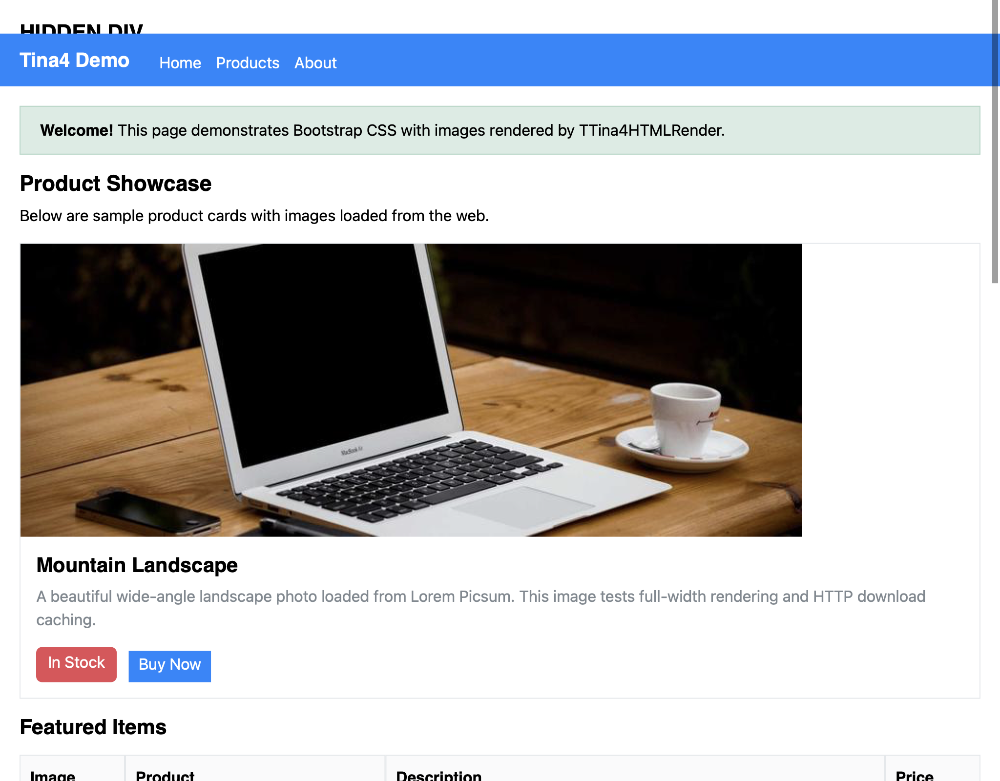

# Tina4Pascal

**HTML-driven native apps in Free Pascal — one codebase, six targets, no
browser, no widget toolkit.**

Tina4Pascal is the Free Pascal sibling of
[Tina4Delphi](https://github.com/tina4stack/tina4delphi). It takes the same
idea — the UI is HTML + CSS, the app is an event loop — and compiles it to
tiny native binaries from a single machine:

| Host: one Mac (or any FPC host) → | macOS | Windows | Linux x64/arm64 | Android | iOS |
|---|---|---|---|---|---|
| hello world, release | 166 KB | 45 KB | 26 / 65 KB | 39 KB | 148 KB |

The proof-of-concept viewer — HTML parser, CSS engine that digests the real
`bootstrap.min.css`, layout, HTTPS images, native macOS window — is a
**1.3 MB** stripped binary:



## How it works

No `TButton`. No components. You hand the renderer HTML (from a Frond/Twig
template, an API, or a string); interaction comes back as semantic events:

```pascal
Render.SetHTML(html);
Render.OnElementClick(obj, method, params);  // onclick="Cart:add('sku42')"
Render.OnFormSubmit(formName, fields);
Render.OnLinkClick(url, handled);
```

Because state lives in the DOM and interaction is events, the same app runs
under a headless backend — a GUI that is scriptable and testable by
construction. See [docs/ARCHITECTURE.md](docs/ARCHITECTURE.md) for the
layering (portable DOM/CSS/layout core, one small shell per OS, software
rasterizer as the road to pixel-identical output everywhere).

## Layout

- `src/` — the portable core + macOS shell
  - `Tina4HTMLDom.pas` — DOM, HTML parser, CSS selector engine, computed
    styles (ported line-for-line from Tina4Delphi's `Tina4HTMLRender.pas`;
    113-assertion test suite in `tests/`)
  - `Tina4HTMLLayout.pas` — block/inline/table layout + painting via the
    canvas contract
  - `Tina4RenderBackend.pas` — the platform contract (canvas, window, events,
    images)
  - `Tina4ShellCocoa.pas` — macOS shell: pure Objective-Pascal (CocoaAll),
    no Lazarus/LCL
- `examples/htmlviewer/` — the viewer app in the screenshot
- `toolchain/` — `build-crosses.sh` builds every cross-compiler from one Mac
- `docs/TOOLCHAIN.md` — **the formula**: every pitfall of building the
  FPC 3.2.2 cross toolchain on Apple Silicon, with fixes (20 and counting)

## Quick start (macOS)

```sh
# toolchain: see docs/TOOLCHAIN.md (brew fpc bootstrap → ~/fpc with crosses)
cd examples/htmlviewer
mkdir -p csscache && curl -sL -o csscache/bootstrap.min.css \
  https://cdn.jsdelivr.net/npm/bootstrap@5.3.3/dist/css/bootstrap.min.css
PPC_CONFIG_PATH=$HOME/fpc/etc $HOME/fpc/bin/fpc -Mdelphi -Fu../../src htmlviewer.pas
./htmlviewer            # renders bootstrap_test.html; clicks print events
./htmlviewer --snapshot out.png   # self-screenshot (seed of headless mode)
```

Run the DOM/CSS test suite:

```sh
cd tests && PPC_CONFIG_PATH=$HOME/fpc/etc $HOME/fpc/bin/fpc -Mdelphi -Fu../src test_dom.pas && ./test_dom
```

## Roadmap

1. Software rasterizer + pure-Pascal TTF engine → identical pixels on all
   targets, PNG golden tests, and the Android/Windows/Linux shells
   (ANativeWindow / Win32 / X11 blit — ~100 lines each)
2. `:hover`/`:active` repaint, form controls, more CSS coverage
3. Data layer: websockets, SSE, database, REST API (ports of the
   Tina4Delphi units) — template-driven, data-aware native apps
4. Agent skills so AI coders can drive this stack without rediscovering
   the pitfalls

## AI coder skill

The repo ships an agent skill (`skills/tina4pascal-developer/`) that teaches
Claude Code, Codex, and Cursor the architecture rules, the toolchain formula,
and the verification discipline for this stack:

```sh
./scripts/install-skills.sh          # all clients
./scripts/install-skills.sh claude   # or: codex, cursor
```

## Status

Early proof of concept, moving fast. macOS renders; the other five targets
compile and link today (see the size table) and grow shells next.

MIT licensed, part of the [Tina4 stack](https://tina4.com).
