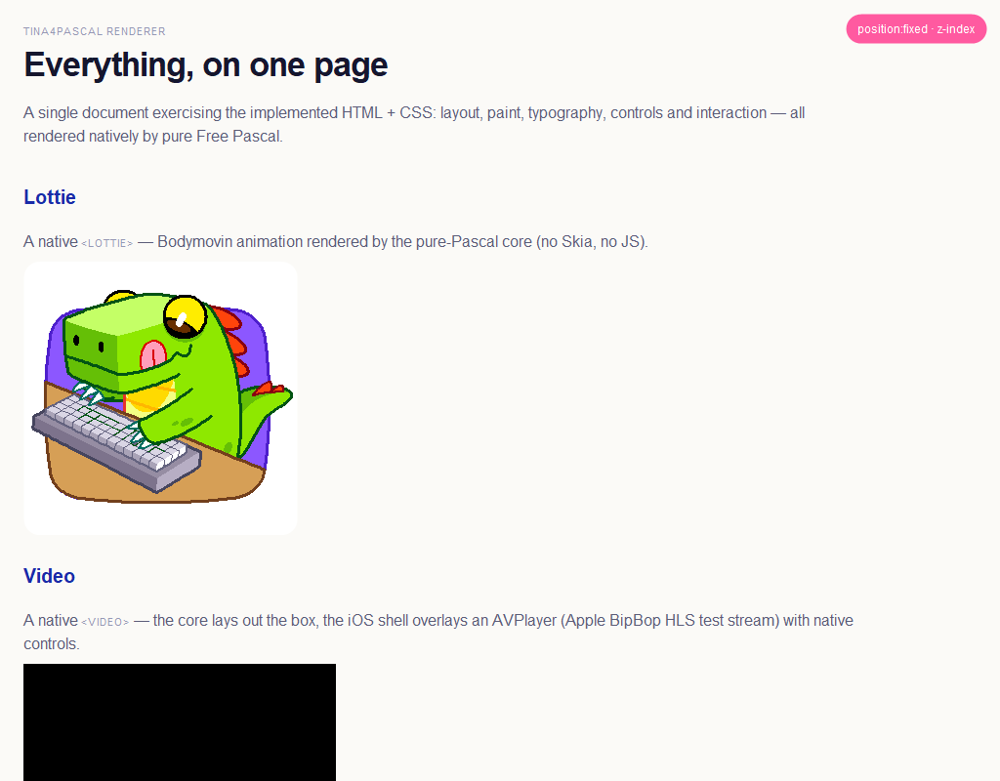
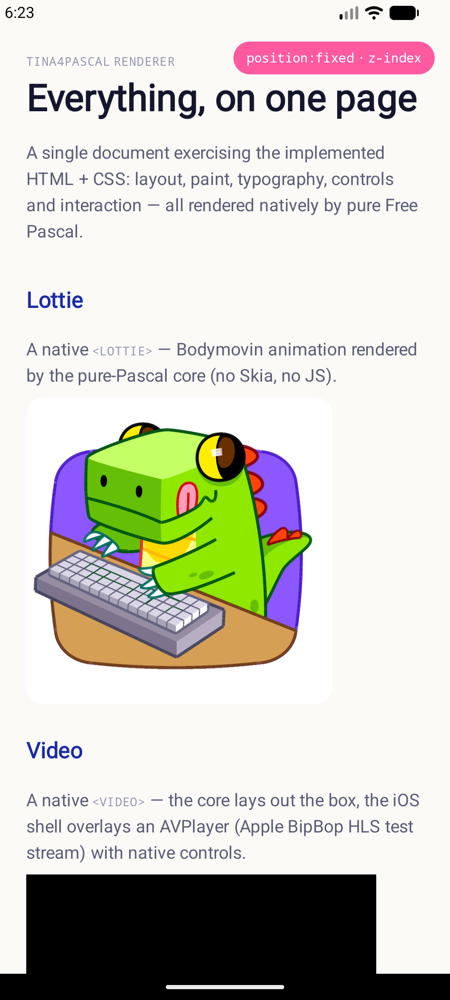

<p align="center">
  
</p>

<h1 align="center">Tina4Pascal</h1>

<p align="center">
  <strong>HTML-driven native apps in Free Pascal — one codebase, six targets,
  no browser, no widget toolkit.</strong>
</p>

Tina4Pascal is the Free Pascal sibling of
[Tina4Delphi](https://github.com/tina4stack/tina4delphi). It takes the same
idea — the UI is HTML + CSS, the app is an event loop — and compiles it to a
**single ~1.3 MB native binary** per target (macOS, Windows, Linux x64/arm64,
Android, iOS) that carries the whole engine and no runtime. See
[App sizes](#app-sizes).

### The same app, rendered natively — no browser, no WebView

<table>
<tr>
<td valign="top"><br><sub><b>Windows</b> · Win32 + GDI+</sub></td>
<td valign="top" align="center"><br><sub><b>Android</b> · JNI → Canvas<br>(built from Windows)</sub></td>
</tr>
</table>

One HTML file — `showcase.html` — byte-identical, drawn by the native engine on
each platform. The **Lottie** dino is a Bodymovin animation rendered by the
pure-Pascal core (**no Skia, no JS**); the same page lays out `<video>`,
gradients, `transform`, `position:fixed` and form controls. The CSS engine even
digests the real `bootstrap.min.css`.

## Install

```powershell
# Windows (PowerShell)
irm https://raw.githubusercontent.com/tina4stack/tina4pascal/main/scripts/install.ps1 | iex
```

```sh
# macOS / Linux
curl -fsSL https://raw.githubusercontent.com/tina4stack/tina4pascal/main/scripts/install.sh | sh
```

That puts `tina4pascal` on your PATH. FPC is fetched on your first `init`, so a
clean machine is ready in about two minutes.

## Quick start

Install (above), then one command:

```sh
tina4pascal init hello
```

It scaffolds the project, fetches FPC if you don't have it, builds, and opens a
native window showing **Hello World!** with the logo — your first app in about
two minutes, same command on every OS. No FPC flags, nothing to install by hand.

Then keep going:

```sh
cd hello
tina4pascal run             # rebuild & run after you edit src/templates + src/routes
tina4pascal build android   # ship an APK (arm64 + armv7 + x86_64), signed
tina4pascal doctor          # see the whole toolchain
```

## Toolsets

Everything you drive the stack with — by hand, from an IDE, or from an AI agent.

| Tool | Where | What it does |
|---|---|---|
| **`tools/tina4pascal`** | macOS / Linux (POSIX sh) | `setup · doctor · init · build · run · render · dom · boxes · inspect · debug · script · deploy · screenshot · compliance` |
| **`tools/tina4pascal.ps1`** | Windows (PowerShell) | same surface, native to Windows; `build {win64,win32,linux,android,all}`, `setup android`, `doctor` |
| **`tools/mcp`** | any (tina4-python) | **MCP server** — exposes the whole loop (`tina4_init/build/run/render/dom/boxes/inspect/script/debug/deploy/screenshot`) so an AI or IDE drives it. See [tools/mcp/README.md](tools/mcp/README.md) |
| **`skills/tina4pascal-developer`** | Claude Code · Codex · Cursor | agent skill: architecture rules, toolchain formula, verification discipline (`./scripts/install-skills.sh`) |
| **`toolchain/build-crosses.sh`** | macOS / Linux | build every FPC cross-compiler from one host |
| **`toolchain/build-android-cross.ps1`** | Windows | build the FPC→Android cross pack (arm64/armv7/x86_64) from source + NDK |
| **`toolchain/sign-release.ps1`** | Windows | EV-sign the pack binaries + CLI via SimplySign ([docs/SIGNING.md](docs/SIGNING.md)) |

`doctor` on either CLI reports the whole chain and tells you exactly what's
missing and how to fix it.

## App sizes

The **whole engine** — HTML parser, CSS cascade, layout, compositor, SVG, QR,
Lottie, video, form controls — is inside every binary, reached by runtime tag
dispatch, so a **feature-complete app is the same size as hello**: the full
viewer is **1.38 MB** vs hello's **1.31 MB** (67 KB apart). Features live in the
engine, not your app.

Release builds, whole engine reachable:

| Target | Artifact | On disk | In package |
|---|---|---:|---:|
| Windows x64 | `.exe` | 1.31–1.38 MB | — |
| Android arm64-v8a | `libtina4.so` | 1.57 MB | 413 KB (compressed) |
| Android armeabi-v7a | `libtina4.so` | 1.23 MB | 389 KB |
| Android x86_64 | `libtina4.so` | 1.40 MB | 415 KB |
| Android APK | all three ABIs | 5.96 MB¹ | — |
| macOS / iOS | `.app` / engine | ~1.4 MB² | — |

¹ dominated by launcher-icon art at every density; a resize-on-package step
(tracked) drops it back to ~1.5 MB. The engine payload is ~1.2 MB across all
three ABIs. ² same engine; measure on a Mac.

## Documentation

| Manual | |
|---|---|
| [Getting started](docs/GETTING-STARTED.md) | zero to a running native app |
| [Cheatsheet](docs/CHEATSHEET.md) | the tag / CSS surface + action & services APIs |
| [Architecture](docs/ARCHITECTURE.md) | portable core, per-OS shells, compositor |
| [Toolchain](docs/TOOLCHAIN.md) | the FPC 3.2.2 cross-build formula (every pitfall) |
| [Android](docs/ANDROID.md) · [android/README.md](android/README.md) | the JNI shell + building APKs (incl. **from Windows**) |
| [iOS](docs/IOS.md) | the on-device iOS shell |
| [Signing](docs/SIGNING.md) | EV code signing the Windows deliverables (SimplySign) |
| [Tooling & distribution](docs/TOOLING-DISTRIBUTION.md) | packaging & release model |
| [Conformance](docs/CONFORMANCE.md) · [CSS index](docs/CSS-PROPERTY-INDEX.md) · [HTML index](docs/HTML-ELEMENT-INDEX.md) | what renders, tracked against the spec |
| [Roadmap](docs/ROADMAP.md) | where it's going |

## How it works

No `TButton`. No components. You hand the renderer HTML (from a Frond/Twig
template, an API, or a string); interaction comes back as semantic events:

```pascal
Render.SetHTML(html);
Render.OnElementClick(obj, method, params);  // onclick="Cart:add('sku42')"
Render.OnFormSubmit(formName, fields);
Render.OnLinkClick(url, handled);
```

Because state lives in the DOM and interaction is events, the same app runs
under a headless backend — a GUI that is scriptable and testable by
construction. See [docs/ARCHITECTURE.md](docs/ARCHITECTURE.md) for the
layering (portable DOM/CSS/layout core, one small shell per OS, software
rasterizer as the road to pixel-identical output everywhere).

## Layout

- `src/` — the portable core + macOS shell
  - `Tina4HTMLDom.pas` — DOM, HTML parser, CSS selector engine, computed
    styles (ported line-for-line from Tina4Delphi's `Tina4HTMLRender.pas`;
    113-assertion test suite in `tests/`)
  - `Tina4HTMLLayout.pas` — block/inline/table layout + painting via the
    canvas contract
  - `Tina4RenderBackend.pas` — the platform contract (canvas, window, events,
    images)
  - `Tina4ShellCocoa.pas` — macOS shell: pure Objective-Pascal (CocoaAll),
    no Lazarus/LCL
- `examples/htmlviewer/` — the viewer app in the screenshot
- `toolchain/` — `build-crosses.sh` builds every cross-compiler from one Mac
- `docs/TOOLCHAIN.md` — **the formula**: every pitfall of building the
  FPC 3.2.2 cross toolchain on Apple Silicon, with fixes (20 and counting)

## Quick start (macOS)

```sh
# toolchain: see docs/TOOLCHAIN.md (brew fpc bootstrap → ~/fpc with crosses)
cd examples/htmlviewer
mkdir -p csscache && curl -sL -o csscache/bootstrap.min.css \
  https://cdn.jsdelivr.net/npm/bootstrap@5.3.3/dist/css/bootstrap.min.css
PPC_CONFIG_PATH=$HOME/fpc/etc $HOME/fpc/bin/fpc -Mdelphi -Fu../../src htmlviewer.pas
./htmlviewer            # renders bootstrap_test.html; clicks print events
./htmlviewer --snapshot out.png   # self-screenshot (seed of headless mode)
```

Run the DOM/CSS test suite:

```sh
cd tests && PPC_CONFIG_PATH=$HOME/fpc/etc $HOME/fpc/bin/fpc -Mdelphi -Fu../src test_dom.pas && ./test_dom
```

## Quick start (Windows)

The Windows shell is Win32/GDI with **DIB-section offscreen compositing** — so
`filter`, `mix-blend-mode`, `mask-image`, 3D `transform` and `backdrop-filter`
all render, sharing the same `Tina4Compositor` as macOS/iOS.

```bat
:: 1. Install FPC 3.2.2 — the official installer from https://www.freepascal.org/download.html
::    (puts fpc.exe on PATH; no extra config, unlike the Mac's self-contained ~/fpc)
:: 2. Build + run the viewer:
cd examples\htmlviewer
fpc -Mdelphi -Fu..\..\src htmlviewer_win.pas
htmlviewer_win.exe win-test.html      :: any .html; no arg loads the built-in @demo
```

Cross-compiling the `.exe` from macOS/Linux instead:

```sh
PPC_CONFIG_PATH=$HOME/fpc/etc $HOME/fpc/bin/fpc -Mdelphi -Twin64 -Px86_64 \
  -FE/tmp/w -FU/tmp/w -Fusrc examples/htmlviewer/htmlviewer_win.pas
```

### What's next on Windows

The GDI shell renders shapes, ClearType text, clipping, 2D transforms and the
full compositing pipeline. Remaining work, in order:

1. **Gradients + ``** — `FillLinearGradient`/`DrawImage` are no-ops today;
   wire GDI+ (or WIC) for gradient fills and image decode/draw.
2. **Per-pixel alpha on ordinary fills** — plain `rgba()` / semi-transparent
   backgrounds paint opaque (GDI limitation). The DIB-section path already
   fixes alpha for *composited* elements; extend it to normal fills.
3. **Rounded-corner alpha inside a filtered box** — a `filter`/`blur` on a
   `border-radius` box shows square corners (GDI doesn't hand us coverage);
   recover it by rasterising the clip shape into the layer's alpha channel.
4. **Advanced blend modes** — color-dodge/burn, hue/saturation/color/luminosity
   currently fall back to source-over; add them to `BlendPixel`.
5. **HiDPI** — the shell runs at density 1; read the per-monitor DPI and
   supersample the layers.

See `src/Tina4ShellWin.pas` (canvas) and `examples/htmlviewer/htmlviewer_win.pas`
(the Win32 host + message loop).

## The full stack

```
Frond (templates)  ─▶  Tina4HTMLDom + Tina4HTMLLayout (render)  ─▶  platform shell (native window)
      ▲                                                                        │
      └──────  data layer: REST · SSE · WebSockets  ◀── events (click/submit) ─┘
```

One HTML-driven model, six targets from one Mac. Each layer has a design doc:

| Layer | Status | Doc |
|---|---|---|
| Renderer (DOM/CSS/layout) | working on macOS, systematic conformance push | [CONFORMANCE.md](docs/CONFORMANCE.md), [CSS-PROPERTY-INDEX.md](docs/CSS-PROPERTY-INDEX.md), [HTML-ELEMENT-INDEX.md](docs/HTML-ELEMENT-INDEX.md) |
| Platform shells | macOS (Cocoa) + iOS (on-device) + Windows (GDI) done, all with offscreen filter/blend/mask/3D compositing; Android shell (no compositing yet); Linux/X11 host next | [ARCHITECTURE.md](docs/ARCHITECTURE.md) |
| Data layer (WS/SSE/API) | designed, ports of tina4delphi units | [ROADMAP-DATALAYER.md](docs/ROADMAP-DATALAYER.md) |
| Frond template engine | designed, port of Tina4Frond.pas | [ROADMAP-FROND.md](docs/ROADMAP-FROND.md) |

## Conformance harness

W3C-style reftests (each feature: a test render vs a known-good reference;
pass when they match, Chrome validates the test):

```sh
tools/run-compliance.sh          # reftest suite → PASS/FAIL table
tools/compare.sh bootstrap_test  # stack our render over Chrome for a page
```

## Roadmap

1. **Conformance**: work the reftest FAIL list in dependency order —
   `overflow-x` + `hidden` attribute, then paint the parsed-only visuals
   (opacity, box-shadow, gradients), then **flexbox**, positioning, list
   markers, table spans.
2. **Software rasterizer + pure-Pascal TTF** → identical pixels on every
   target + the Win32 / X11 / Android shells (~100 lines of blit each).
3. **Data layer**: dispatcher → DOM-mutation API → REST → SSE → WebSockets
   (ports of the Tina4Delphi units) — live, data-aware native apps.
4. **Frond**: port the template engine — templates + data → HTML.
5. Keep the agent skills current so AI coders drive the stack without
   rediscovering the pitfalls.

## AI coder skill

The repo ships an agent skill (`skills/tina4pascal-developer/`) that teaches
Claude Code, Codex, and Cursor the architecture rules, the toolchain formula,
and the verification discipline for this stack:

```sh
./scripts/install-skills.sh          # all clients
./scripts/install-skills.sh claude   # or: codex, cursor
```

## Status

Early proof of concept, moving fast. macOS renders; the other five targets
compile and link today (see the size table) and grow shells next.

MIT licensed, part of the [Tina4 stack](https://tina4.com).
