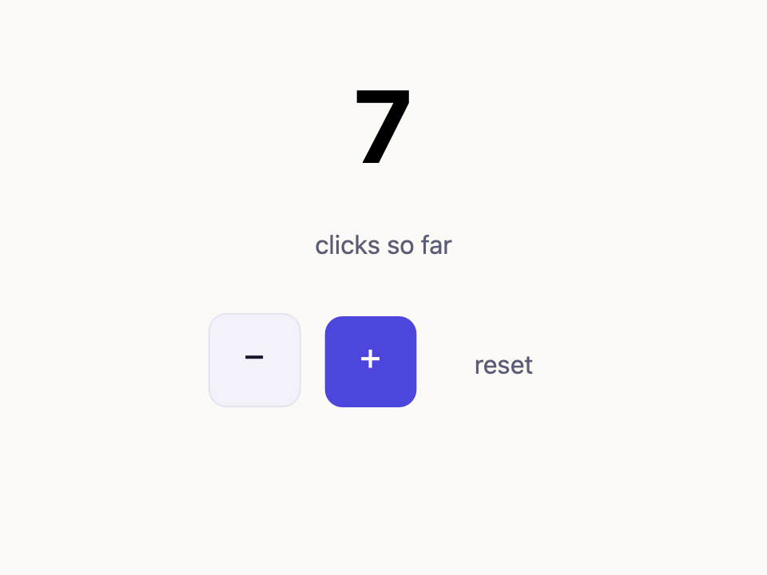

# Counter — the Tina4Pascal app model in ~80 lines

A complete native app with **no widget components**. It shows the whole
pattern you use to build any Tina4Pascal app.



## The pattern

```
   state (Count)  ──Render──▶  HTML string  ──▶  layout  ──▶  native pixels
        ▲                                                          │
        └──────────  Click:  hit-test → onclick handler  ◀─────────┘
```

1. **State is yours** — here, one integer `Count`. No `TButton`, no bindings.
2. **`Render`** turns state into an HTML string and lays it out. Change state,
   call `Render`, the renderer repaints. (A real app builds the HTML from a
   Frond template instead of concatenation.)
3. **Interaction is semantic events** — a click is hit-tested to the deepest
   element, then walks up to the nearest `onclick="Counter:Inc()"`. The handler
   string is the contract; your app decides what it means.

That's it. The same three steps drive a form (submit → name/value pairs), a
live dashboard (a WebSocket message → `Render`), or a whole screen flow.

## Build & run (macOS)

```sh
export PPC_CONFIG_PATH=$HOME/fpc/etc
$HOME/fpc/bin/fpc -Mdelphi -Fu../../src counter.pas
./counter                       # click −, +, reset
./counter out.png               # render a snapshot (starts at 7) and exit-capture
```

Release build (`-O2 -XX -CX -Xs`) is ~1.3 MB. The exact same source
cross-compiles to Windows / Linux / Android / iOS from this Mac — only the
platform shell differs (see `docs/ARCHITECTURE.md`).

## Where to go next

- `examples/htmlviewer/` — the full viewer: external CSS, images, forms,
  scrolling, drag/momentum, the scripted headless driver.
- `docs/ROADMAP-DATALAYER.md` — wiring `Render` to REST / SSE / WebSockets.
- `docs/ROADMAP-FROND.md` — replacing the HTML string with a template.
